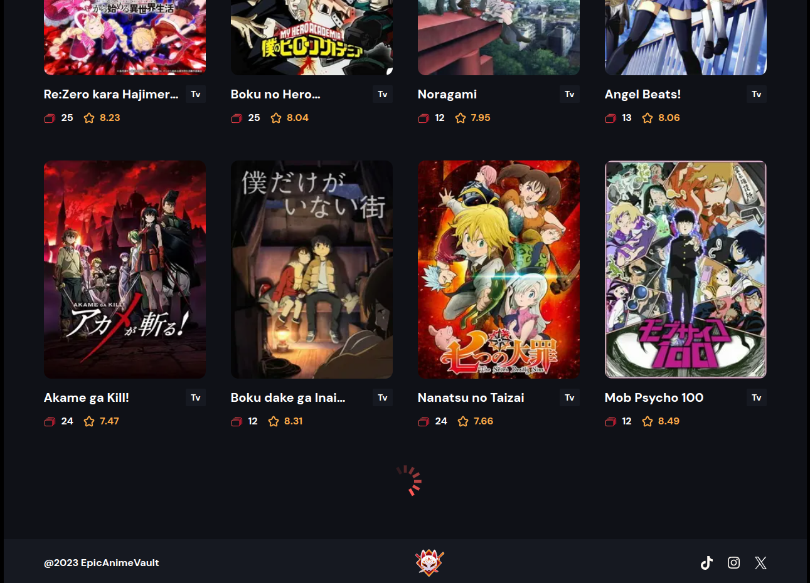

# Anime Valut Infinte Scroll

In this wonderful Anime website I implemented the Infinite Scroll Functionality and also loading the data with Framer Motion, this gives the User a wonderful experience

## Link to Live App

<https://infinte-scroll-pi.vercel.app/>

## Preview

## Installation

1. Clone the repo and `cd` into it
2. Run `npm install` to install all required dependencies (this will create a /node_modules folder)
3. Then Run `npm run dev` to serve your project to localhost:3000
4. Enjoy
